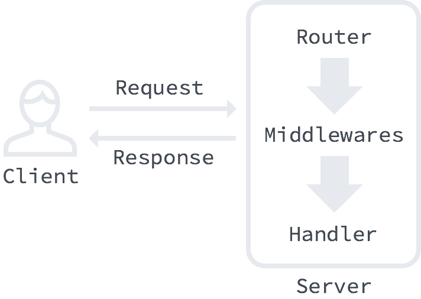

**GitHub上所有 Awesome Awesomeness 系列集合**
	
* [http://www.open-open.com/lib/view/open1412995981217.html](http://www.open-open.com/lib/view/open1412995981217.html)
* [http://talks.golang.org/](http://talks.golang.org/)
* [http://jsonapi.org/](http://jsonapi.org/)

* **[http://semantic-ui.com/](http://semantic-ui.com/)**
* **[www.jqwidgets.com](www.jqwidgets.com)**
* [http://www.zebkit.com/](http://www.zebkit.com/):基于Canvas的
* [https://jimmyfrasche.github.io/go-reflection-codex/](https://jimmyfrasche.github.io/go-reflection-codex/)go反射参考
* [http://www.evanlin.com/til-2016-03-29/](http://www.evanlin.com/til-2016-03-29/)把http.response.body 在關閉前先清乾淨可以達到重複使用增加四倍速度 
* [https://ngrok.com/](https://ngrok.com/)Secure tunnels to localhost
* [https://github.com/inconshreveable/ngrok](https://github.com/inconshreveable/ngrok)

>工作平台:
>
* `worktile`:[https://worktile.com/](https://worktile.com/)
* `teambition`:[https://www.teambition.com](teambition)
* `今目标`:[http://www.jingoal.com](http://www.jingoal.com)
* `国外的trello.com`:[https://trello.com/](https://trello.com/)

	以上其实不完全和go语言库有关,暂时放在这儿

##Go语言(golang)开源项目大全
* [http://www.open-open.com/lib/view/1396063913278](http://www.open-open.com/lib/view/1396063913278)

##非常棒的Go语言框架，库和软件集合：Awesome Go
* [http://awesome-go.com/](http://awesome-go.com/)
* [https://github.com/avelino/awesome-go](https://github.com/avelino/awesome-go)
* [http://www.open-open.com/lib/view/open1442132093137.html](http://www.open-open.com/lib/view/open1442132093137.html)

##web框架相关

**有用的文档**  

* [Architecture for a Golang Web App](https://larry-price.com/blog/2015/06/25/architecture-for-a-golang-web-app)
* [Build You Own Web Framework In Go](https://www.nicolasmerouze.com/build-web-framework-golang/).
	* 作者基于该文章的github库：[https://github.com/nmerouze/stack](https://github.com/nmerouze/stack)

## go的扩展库在github

* [https://github.com/golang](https://github.com/golang)

**框架**  

* [https://github.com/revel/revel)](https://github.com/revel/revel):A high productivity, full-stack web framework for the Go language.  
* [https://github.com/astaxie/beego](https://github.com/astaxie/beego):beego is an open-source, high-performance web framework for the Go programming language.
 
##MiddleWare

* `codegangsta/negroni`:[https://github.com/codegangsta/negroni](https://github.com/codegangsta/negroni):Idiomatic HTTP Middleware for Golang 
* [https://github.com/go-martini/martini](https://github.com/go-martini/martini):Classy web framework for Go.建议用`negroni`代替.

>**框架的问题在于接口协议不统一.对开发者而言,很难找到可用的插件.**

##Routers

* `julienschmidt/httprouter`:[https://github.com/julienschmidt/httprouter](https://github.com/julienschmidt/httprouter)可以和`negroni`一起使用.示例:
	* [My favorite Go multiplexer](http://www.peterbe.com/plog/my-favorite-go-multiplexer)
* `go-zoo/bone`:[https://github.com/go-zoo/bone](https://github.com/go-zoo/bone)
* `gorilla/mux`:[https://github.com/gorilla/mux](https://github.com/gorilla/mux)

## Middleware和Router的关系如下:

框架处理如下逻辑:

* error/panic
* logging
* security
* sessions
* cookies
* body parsing

## 编码解码

bitly公司开源了一个叫做 simplejson 的包,在处理未知结构体的JSON时相当方便.

* `simplejson`:[https://github.com/bitly/go-simplejson](https://github.com/bitly/go-simplejson)

* jsonAPI相关

	* [api2go](https://github.com/manyminds/api2go) is a full-fledged library to make it simple to provide a JSON API with your Golang project.
	* [jsonapi](https://github.com/shwoodard/jsonapi) serializes and deserializes jsonapi formatted payloads using struct tags to annotate the structs that you already have in your Golang project. [Godoc](http://godoc.org/github.com/shwoodard/jsonapi)
	* [go-json-spec-handler](https://github.com/derekdowling/go-json-spec-handler) straightforward drop-in library for handling requests and sending responses in an existing API.

##命令行程序框架

* [https://github.com/codegangsta/cli](https://github.com/codegangsta/cli)

##开发windows服务

>* import "golang.org/x/sys/windows/svc"

Package svc provides everything required to build Windows service.

##go调用COM

* `go调用COM`: [https://github.com/go-ole/go-ole](https://github.com/go-ole/go-ole)

##开发工具

* [https://github.com/gogits/gogs](https://github.com/gogits/gogs):Go语言开发的Git service
* [https://github.com/laher/goxc](https://github.com/laher/goxc):Go语言跨平台编译
* [https://github.com/lionkov/go9p](https://github.com/lionkov/go9p):Go语言9P协议实现

##错误处理
* [https://github.com/juju/errors](https://github.com/juju/errors)  

##常用函数工具库
* [https://github.com/choleraehyq/gofunctools](https://github.com/choleraehyq/gofunctools) 

##网络相关

* `abh/geodns`:Go实现的DNS服务器.[https://github.com/abh/geodns](https://github.com/abh/geodns)  
* `miekg/dns`:Go DNS类库.[https://github.com/miekg/dns](https://github.com/miekg/dns)
* `go-imap`:[https://github.com/mxk/go-imap](https://github.com/mxk/go-imap).
	* 示例:[https://gist.github.com/ser1zw/dc0157b6a4fcc46fd160](https://gist.github.com/ser1zw/dc0157b6a4fcc46fd160)
* `nats`:High Performance Golang Server for NATS, the cloud native messaging system. [https://github.com/nats-io/gnatsd](https://github.com/nats-io/gnatsd) 

##全文检索客户端

* `Go-Solr`:[https://github.com/rtt/Go-Solr/](https://github.com/rtt/Go-Solr/)

## web服务相关

* [`package context`](https://godoc.org/golang.org/x/net/context): import "golang.org/x/net/context"
* Session处理:[https://github.com/heroku-examples/go-sessions-demo](https://github.com/heroku-examples/go-sessions-demo)
* Session处理:[https://devcenter.heroku.com/articles/go-sessions](https://devcenter.heroku.com/articles/go-sessions)
* 综合工具:[http://www.gorillatoolkit.org/](http://www.gorillatoolkit.org/)
* `Gzip Performance for Go Webservers`:
	* [https://blog.klauspost.com/gzip-performance-for-go-webservers/](https://blog.klauspost.com/gzip-performance-for-go-webservers/)
	
相关的资源:

* [https://github.com/xi2/httpgzip](https://github.com/xi2/httpgzip)
* [https://github.com/klauspost/compress](https://github.com/klauspost/compress)

##数据库
* `TiDB` is a distributed SQL database compatible with MySQL protocol.Inspired by the design of Google F1, TiDB supports the best features of both traditional RDBMS and NoSQL.  
	* **值得关注,尚未成熟.**

	* [https://github.com/pingcap/tidb](https://github.com/pingcap/tidb) 

* `HouzuoGuo/tiedot`是Golang语言写的NOSQL几乎唯一可用库
	* [https://github.com/HouzuoGuo/tiedot](https://github.com/HouzuoGuo/tiedot)
* `https://github.com/allegro/bigcache`Go语言的大数据缓存实现
 	* [https://github.com/allegro/bigcache](https://github.com/allegro/bigcache)
